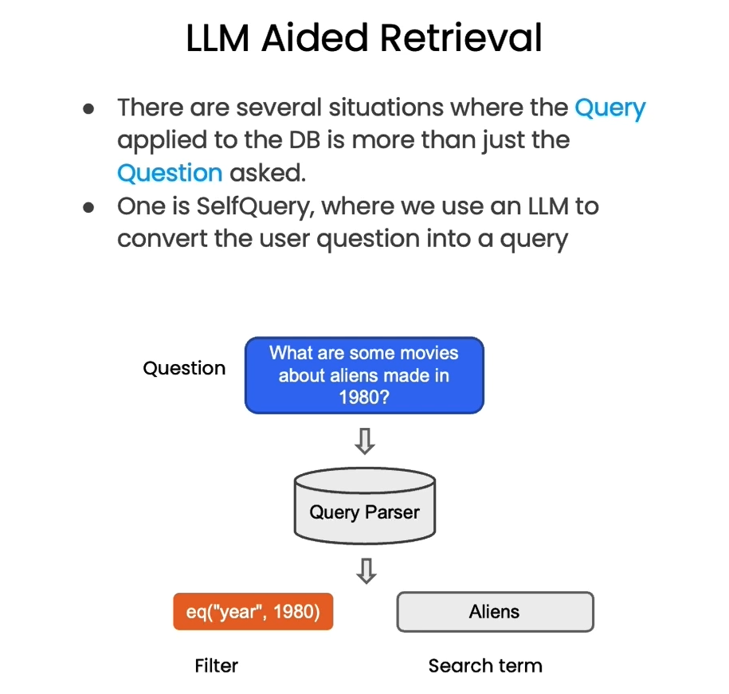

# Langchain-chat-with-your-data
See full documentation of langchain functions [here](https://integrations.langchain.com/).

## Document Loading
There exist a lot of document loading APIs in the langchain library:
- Youtube video loader,
- PDF loader,
- Directory loader,
- Webpage loader...

After loading the documents, we need to split it in smaller chunks. This is relevant because when we are doing the retrieval augmented generation, you need to retrieve the piece of content that are only relevant.

See full [documentation](https://python.langchain.com/docs/modules/data_connection/document_loaders.html)

## Document Splitting
We have to be careful when we split into chunks to keep the context:
    e.g. The toyota camry has a head snapping  80HP and an eight speed automatic transmission
    Chunk 1: The toyota camry has a head snapping
    Chunk 2: 80HP and an eight speed automatic transmission

There is a lot of types of splitters.

See full [documentation](https://python.langchain.com/docs/modules/data_connection/document_transformers/)

## Vectorstores and embeddings
Once we have our chunks, we encode each chunk using embeddings. We then store them in a vector store. 
When the chatbot receive a question, it goes to the vectorstore and search for the n most similar to the embedding of the questions.
We will see in the next section how to retrieve efficiently.

## Retrieval
We may not always want to retrieve the most similar results. We use MMR to solve this:

  

When you get questions that aren't only about the content but also the metadata that you want to filter on. We use Aided Retrieval.

  

We also use compression to make sure we are extracting the relevant infos:

  

We can use LLMs to do this automatically. There exist other NLP methods to do this without using filters like SVM.

## Question Answering
By default all the chunks are given to the language model with the query.

  

3 method are generally used to fix that:

  

This involves many more calls and is thus more expansive.

## Memory

  

