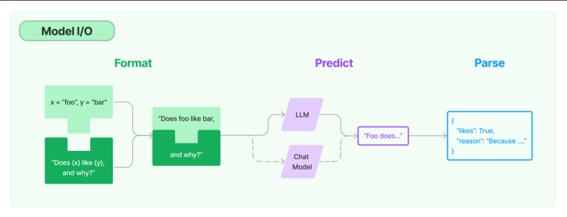
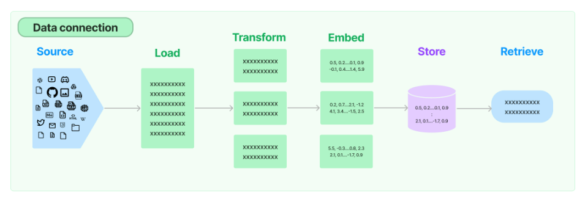

# Documentation of LangChain
LangChain is a framework for developing applications powered by language models. It enables applications that are:
- Data-aware: connect a language model to other sources of data,
- Agentic: allow a language model to interact with its environment.

The main value props of LangChain are:

- Components: abstractions for working with language models, along with a collection of implementations for each abstraction. Components are modular and easy-to-use, whether you are using the rest of the LangChain framework or not,
- Off-the-shelf chains: a structured assembly of components for accomplishing specific higher-level tasks.
Off-the-shelf chains make it easy to get started. For more complex applications and nuanced use-cases, components make it easy to customize existing chains or build new ones.

# Use Cases
The Langchain library has a walkthroughs of common end-to-end use cases.

See [documentation](https://python.langchain.com/docs/use_cases)

# Model I/O 
The core building blocks for a language model application are:
- [Prompts](#prompts): Prompts refer to the input to the model. We generally use *Prompt Template* or *Example Selectors*.
- [Language Models](#language-models): Make calls to language models through common interfaces
- [Output Parsers](#output-parsers): Extract information from model outputs

## Prompts
### Prompt Template
A prompt template refers to a reproducible way to generate a prompt. It contains a text string ("the template"), that can take in a set of parameters from the end user and generates a prompt.

A prompt template can contain:

- instructions to the language model,
- a set of few shot examples to help the language model generate a better response,
- a question to the language model.

### Example Selectors
If you have a large number of examples, you may need to select which ones to include in the prompt. The Example Selector is the class responsible for doing so.

## Language Models
If you are using a specific model it's recommended you use the methods specific to that model class (i.e., "predict" for LLMs and "predict messages" for Chat Models)

### LLMs
Models that take a text string as input and return a text string. LLMs in LangChain refer to pure text completion models. The APIs they wrap take a string prompt as input and output a string completion. LangChain provides wrappers for OpenAI, Cohere, Hugging Face... available in the llms class.

### Chat Models
Chat models are often backed by LLMs but tuned specifically for having conversations. Unlike LLMs, chat models take into account the conversational context and history to generate contextually appropriate responses. LangChain provides wrappers for ChatOpenAI (gpt-3.5-turbo), googlePalm... available in the chat_models class.

## Output parsers
Output parsers are classes that help structure language model responses. There are two main methods an output parser must implement:

"Get format instructions": A method which returns a string containing instructions for how the output of a language model should be formatted.
"Parse": A method which takes in a string (assumed to be the response from a language model) and parses it into some structure.

# Data connection
Many LLM applications require user-specific data that is not part of the model's training set. LangChain gives you the building blocks to load, transform, store and query your data via:

- Document loaders: Load documents from many different sources
- Document transformers: Split documents, drop redundant documents, and more
- Text embedding models: Take unstructured text and turn it into a list of floating point numbers
- Vector stores: Store and search over embedded data
- Retrievers: Query your data

# Chains
It is the most important key block of LangChain. It combines a LLM with a template and we can combines these blocks together to carry on a sequence of operations on the data and lead to a step by step thinking of the model. Some of these chains models are:

1. LLM Chain: Basic chain techniques where we chain the prompt with the model.

2. Sequential Chains: Run chain one after the other.

3. Router Chain: More complicated than the others. You built sub-chains each of which specialised for some input (can be classified depending on the subject).

4. Question Answering over documents: Answer question on a document and data which the model were not trained on, which makes it much more flexible.

# Agents
An agent has access to a suite of tools, and determines which ones to use depending on the user input. Agents can use multiple tools, and use the output of one tool as the input to the next.

There are two main types of agents:

Action agents: at each timestep, decide on the next action using the outputs of all previous actions
Plan-and-execute agents: decide on the full sequence of actions up front, then execute them all without updating the plan
Action agents are suitable for small tasks, while plan-and-execute agents are better for complex or long-running tasks that require maintaining long-term objectives and focus. 

# Memory
LangChain provides memory components in two forms. First, LangChain provides helper utilities for managing and manipulating previous chat messages. These are designed to be modular and useful regardless of how they are used. Secondly, LangChain provides easy ways to incorporate these utilities into chains.

# Callbacks
LangChain provides a callbacks system that allows you to hook into the various stages of your LLM application. This is useful for logging, monitoring, streaming, and other tasks.